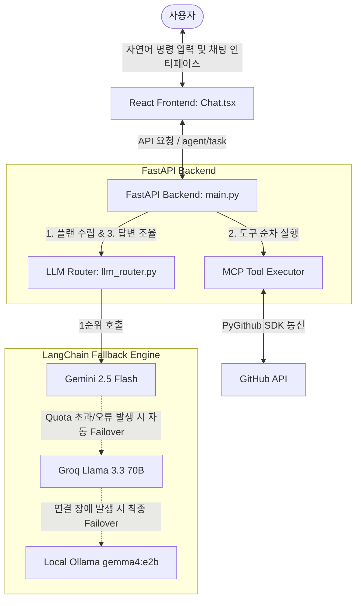
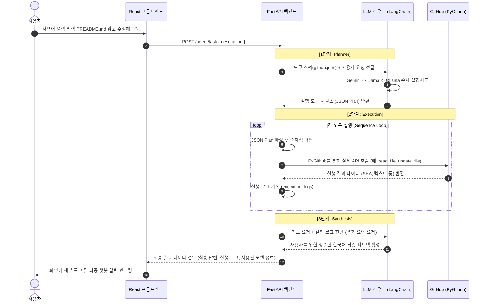

# ARCHITECTURE.md — 시스템 아키텍처 및 데이터 흐름

본 문서는 **GitHub MCP 에이전트 학습용 예제 프로젝트**의 시스템 구조와 모듈 간 상호작용, 특히 LangChain 기반의 3단계 Fallback 처리 매커니즘을 상세히 설명합니다.

---

## 🏗️ 전체 시스템 구조도 (System Architecture)

시스템은 단일 사용자 디바이스 혹은 로컬 개발 서버 환경 내에서 **FastAPI 백엔드**와 **Vite+React 프론트엔드**가 협력하여 구동되며, 외부의 **GitHub API** 및 여러 **LLM API**들과 연동됩니다.

---

## 🔄 핵심 에이전트 루프 흐름 (Agent Loop Flow)

사용자가 입력창에 자연어로 요청(예: *"README.md를 읽고 업데이트해줘"*)을 보냈을 때 백엔드 내부에서 동작하는 상세 라이프사이클입니다.

---

## 🛡️ 3단계 LLM Fallback 연동 아키텍처

본 프로젝트의 핵심 학습 포인트는 LangChain의 `with_fallbacks` 메소드를 결합한 고가용성 AI 모델 연동입니다.

1. **Gemini 2.5 Flash (Google)**:
   - **역할**: 주 분석 및 계획 생성(Primary).
   - **선정 이유**: 높은 토큰 윈도우와 빠른 속도, 우수한 JSON 스펙 준수율.
2. **Llama-3.3-70b-versatile (Groq)**:
   - **역할**: 1차 예비용 대형 LLM(Secondary).
   - **선정 이유**: 극도로 빠른 Groq Inference 속도와 준수한 추론 및 지시 이행 능력.
3. **gemma4:e2b (Local Ollama)**:
   - **역할**: 외부 네트워크 단절 또는 API 완전 장애 대응책(Tertiary).
   - **선정 이유**: 로컬 리소스만으로 작동하여 네트워크 에러나 API 키 유출 위험 없이 항상 작동을 보증.

### 예외 및 오류 전파 구조
- LangChain의 `with_fallbacks` 내부에서 각 LLM 커넥터의 예외 클래스(예: `google.api_core.exceptions.GoogleAPICallError`, `groq.APIConnectionError` 등)가 발생하면, 내부적으로 이를 가로채 다음 LLM 인스턴스의 `ainvoke`를 자동으로 촉발시킵니다.
- 최종적으로 3단계 모델마저 동작하지 못할 때에만 사용자에게 HTTP 500 에러를 전송하도록 격리 설계되었습니다.
